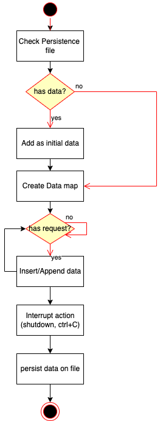
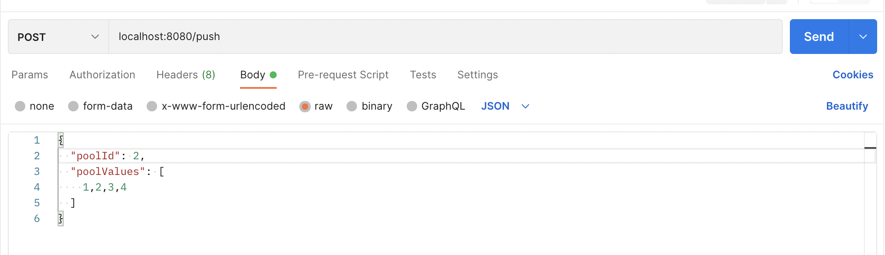
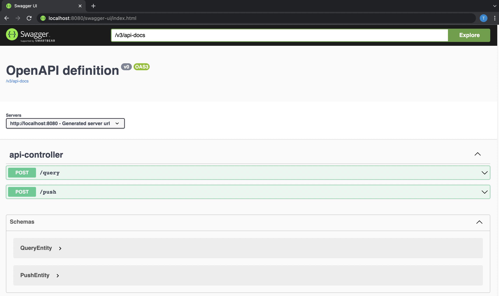

# Thank you for reading this instruction
### This instruction includes:
* Describe about logic flow and answer requirements
* Deploy and run code
* Others

## 1. Describe about logic flow and answer requirements:
### a. Flow:

Users can navigate to 2 endpoints:
* The first one receives data from user with below format:
```json
  {
     "poolId": 123546,
     "poolValues": [
        1, 7, 2, 6
     ]
  }
  ```
if poolId is not existed in the application, we have to add this request and return "inserted".

if poolId is existed in the application, we have to append all values in new request to existed one and return "appended status".
Sample:
```json
{
  "status": "appended"
}
```

* The second one receives data from user with below format:
```json
{
   "poolId": 123546,
   "percentile": 99.5
}
```
The request will return 2 values, one is the sum() of all elements which have poolId as provided in this request and combine with the rate "percentile", and other is number of elements in pool.

If poolId does not exist, it will return error.
Sample:
```json
{
  "calculatedQuantileTotal": 24.68,
  "elementCount": 4
}
```
### b. Answer question as required in email:
##### % *the response from the append is a status field confirming "appended" or "inserted".*
> Discuss as above
##### % *the response from the query has two fields: the calculated quantile and the total count of elements in the pool*
> Discuss as above
##### % *please do not use a library for the quantile calculation if a pool contains less than 100 values.*
> Use Java as native
##### % *focus on high performance if possible (time permitting) and resiliency*
> I architected application as below step:
> 
> > When application start, it will scan the specific file to check stored data if existed, if data file is existed, it will bring it to application as initial values.
> 
> > Application runs with further requests and data (old and new) are stored in ConcurrentHashMap which interface provides Multiple access for storing data and on RAM.
> 
> > When users try to close/exit/terminate application, it automatically triggers method to store all existing data in RAM to file as Persistence.
##### % *reasoning about high-availability and scalability is a nice-to-have*
> Because it used SpringBoot and Java technology for developing, so It can be deployed wit HA and scalability.
##### % *no database; no connection to anything needed. Keep it simple.*
> There are 2 ways to store data, one is database, other is file. Because databases are prevented so I have chosen Serializable file.
##### % *your preferred language.* 
> Java - SpringBoot

Dataflow diagram:



## 2. Deployment and Run
*I prepared 2 ways to run this application:*
* *Java 8 native*
* *Docker*

**Please navigate to tcbhw-api directory before follow instruction!**

### a. Java 8 native:
If your OS has the Java 8 environment and Maven build tools, you just have to run the file:
> *run_using_local_env.sh*

by using command:
```shell
sh run_using_local_env.sh
```
it will take time for downloading some Java and Spring libraries.
### b. Docker
If your OS has the Docker environment, and you know basic how to play with docker, here you are!
please run these command:
```shell
docker build --no-cache --progress=plain -t tcbhw-app .
```
Above command will trigger Dockerfile as mentioned in list of file, and build new image which holds all application.

After done to build image, please run this command:
```shell
docker run -dp 8080:8080 tcbhw-app:latest
```
If you try to use Docker, please ensure just restart container instead of create new one for testing, because if you create new container, old data will be lost.

After one of both step, you will receive SpringBoot logs as below:
```text

  .   ____          _            __ _ _
 /\\ / ___'_ __ _ _(_)_ __  __ _ \ \ \ \
( ( )\___ | '_ | '_| | '_ \/ _` | \ \ \ \
 \\/  ___)| |_)| | | | | || (_| |  ) ) ) )
  '  |____| .__|_| |_|_| |_\__, | / / / /
 =========|_|==============|___/=/_/_/_/
 :: Spring Boot ::                (v2.6.4)

2022-03-03 11:29:40.870  INFO 1 --- [           main] c.hanhtd26.tcbhwapi.TcbhwApiApplication  : Starting TcbhwApiApplication v0.0.1-SNAPSHOT using Java 17.0.2 on 508cbbce53d9 with PID 1 (/root/tcbhw-api/target/tcbhw-api-spring-boot.jar started by root in /root/tcbhw-api)
2022-03-03 11:29:40.872  INFO 1 --- [           main] c.hanhtd26.tcbhwapi.TcbhwApiApplication  : No active profile set, falling back to 1 default profile: "default"
2022-03-03 11:29:41.454  INFO 1 --- [           main] o.s.b.w.embedded.tomcat.TomcatWebServer  : Tomcat initialized with port(s): 8080 (http)
2022-03-03 11:29:41.460  INFO 1 --- [           main] o.apache.catalina.core.StandardService   : Starting service [Tomcat]
2022-03-03 11:29:41.460  INFO 1 --- [           main] org.apache.catalina.core.StandardEngine  : Starting Servlet engine: [Apache Tomcat/9.0.58]
2022-03-03 11:29:41.493  INFO 1 --- [           main] o.a.c.c.C.[Tomcat].[localhost].[/]       : Initializing Spring embedded WebApplicationContext
2022-03-03 11:29:41.493  INFO 1 --- [           main] w.s.c.ServletWebServerApplicationContext : Root WebApplicationContext: initialization completed in 589 ms
2022-03-03 11:29:41.987  INFO 1 --- [           main] o.s.b.w.embedded.tomcat.TomcatWebServer  : Tomcat started on port(s): 8080 (http) with context path ''
2022-03-03 11:29:41.993  INFO 1 --- [           main] c.hanhtd26.tcbhwapi.TcbhwApiApplication  : Started TcbhwApiApplication in 1.329 seconds (JVM running for 1.533)
```

## 3. Testing

After RESTApi server started, there are 2 ways to test API, which are:
* **Tools as Postman, curl**
* **Swagger UI v3**   - *I embedded it in application*

#### Tools:


#### Swagger UI:


###  *Thank you so much for testing this application*
### *If you have any question or doubt, please PM via HR!*
